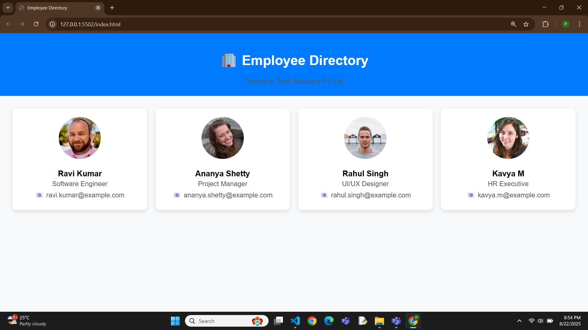

# 🏢 Employee Directory – Responsive Team Profiles  

A simple and responsive **Employee Directory** built using **HTML and CSS**.  
This project displays employee profiles in a clean card layout with names, roles, and contact information.  

---

## ✨ Features  
- Responsive grid layout for employee cards  
- Profile photos, names, designations, and emails  
- Hover effect with smooth card elevation  
- Clean, minimal, and professional UI  

---

## 🚀 Tech Stack  
- **HTML5**  
- **CSS3 (Grid & Flexbox)**  

---

## 📸 Preview  
  
*(Replace with actual screenshot path if different)*  

---

## 📌 Use Cases  
- Internal company employee directory  
- Team introduction page for a website  
- Beginner project to practice **HTML & CSS layouts**  

---

## ⚡ How to Run  
1. Clone this repository:  
   ```bash
   git clone https://github.com/your-username/employee-directory.git
